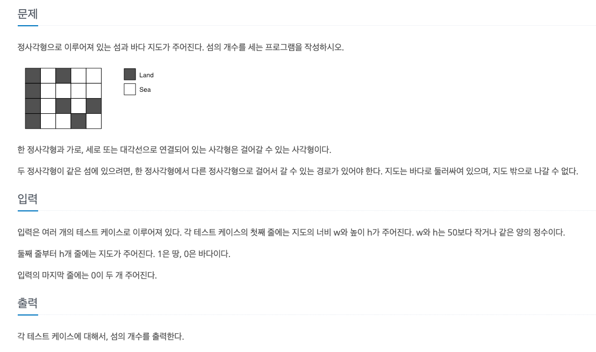

# 2023년 8월 9일 TIL


 ## Jshell
Rails의 Console창 처럼 자바에 대한 Test를 진행할 수 있는 프로토타이핑을 위한 도구 <br>
Jshell은 JDK 9에서 처음 도입되어 즉석으로 테스트코드를 터미널에서 작성하여 결과를 확인할 수 있도록 돕는다. <br>
시작: 터미널에서 'jshell'입력 <br>
종료: 터미널에서 '/exit'입력 <br>

<br>

jshell에서 결과값 출력하는 법
> System.out.println(x)

<br>

jshell 유용 단축키
- ctrl + A : 문장 맨앞으로 커서 옮기기
- ctrl + E : 문장 맨끝으로 커서 옮기기
- ctrl + R : 사용했던 명령어 검색


<br>


## 알고리즘
### 백준 4963번


BFS로 풀 수 있는 문제로 BFS로 풀이했다. <br>
우선 코드 입력 전에 공통적으로 사용하는 라이브러리나 변수를 입력해준다. <br>
> import sys <br>
> from collections import deque <br>
> input = sys.stdin.readline <br>

<br>

자, 이제 문제의 요구사항에 맞춰 하나씩 살펴보자. <br>
> 첫째 줄에는 지도의 너비 w와 높이 h가 주어진다. <br>
> 둘째 줄부터 h개 줄에는 지도가 주어진다. 1은 땅, 0은 바다이다. <br>
> 입력의 마지막 줄에는 0이 두 개 주어진다.

위의 요구사항을 하나씩 분석해보자. <br>
입력의 마지막 줄에 '0, 0'이 입력되기 전까지는 입력을 계속해서 받는다. <br>
이 경우 while문을 이용해 '0, 0'이 입력되기 전까지는 bfs가 반복해서 실행되도록 설정할 수 있을 것이다. <br>
이때, '0, 0' 입력을 받는 경우 'break'로 반복문을 종료한다. <br>

<br>

지도의 너비와 높이를 입력받고 graph를 입력받아야 한다. <br>
나의 경우 다음과 같은 코드로 graph를 입력받았다. <br>
```python
w, h = map(int, input().split())
graph = [list(map(int, input().split())) for _ in range(h)]
```

<br>

위에서 언급한 반복문과 그래프 코드를 합치면 다음과 같다. <br>
```python
while True:
    w, h = map(int, input().split())
    if w == h == 0:
        break

    graph = [list(map(int, input().split())) for _ in range(h)]
```


<br>

이제, bfs method를 작성해야 한다. <br>
bfs 메서드 작성 전에 그래프에 이동 방향에 대한 리스트가 있어야 한다. <br>
이동 방향 리스트는 섬의 개수를 확인할 때 어느 방향으로 이동할 지 결정하는 역할을 한다. <br>
> d = [(-1, -1), (0, -1), (1, -1), (1, 0), (1, 1), (0, 1), (-1, 1), (-1, 0)]

<br>

bfs 메서드를 작성해보자. <br>
매개 변수로는 시작 좌표를 받는다. <br>
어떤 섬부터 bfs 탐색을 할 지 모르기 때문에 시작 지점을 변수로 받는다. <br>

```python
def bfs(i, j):
    q = deque()
    q.append((i, j))

    while q:
        y, x = q.popleft()
```

여기서 입력받는 너비 w의 경우 graph의 두 번째 인덱스가 되고, <br>
높이 h의 경우 graph의 첫 번째 인덱스가 된다.

<br>

이제 위에서 입력한 방향 리스트 'd'를 통해 이동할 좌표를 결정하고, <br>
이동한 좌표가 유효한 값인지 확인한다.

```python
def bfs(i, j):
    q = deque()
    q.append((i, j))

    while q:
        y, x = q.popleft()

        for dy, dx in d:
        nx = x + dx
        ny = y + dy

        if (0 <= ny < h) and (0 <= nx < w) and graph[ny][nx] == 1:   
```

섬인 경우(graph의 값이 1인 경우) + 인덱스 범위를 벗어나지 않는 것을 유효한 조회 조건으로 설정한다. <br>
이때, 한 번 조회한 경우 그래프의 값을 0으로 변경해 다시 조회하지 않도록 한다. <br>

```python
def bfs(i, j):
    q = deque()
    q.append((i, j))

    while q:
        y, x = q.popleft()

        for dy, dx in d:
        nx = x + dx
        ny = y + dy

        if (0 <= ny < h) and (0 <= nx < w) and graph[ny][nx] == 1: 
            graph[ny][nx] = 0
            q.append((ny, nx))  
```

자, 이제 다 합쳐서 다시 작성해보자.
```python
import sys
from collections import deque
input = sys.stdin.readline

d = [(-1, -1), (0, -1), (1, -1), (1, 0), (1, 1), (0, 1), (-1, 1), (-1, 0)]


def bfs(i, j):
  q = deque()
  q.append((i, j))

  while q:
    y, x = q.popleft()

    for dy, dx in d:
      nx = x + dx
      ny = y + dy

      if (0 <= ny < h) and (0 <= nx < w) and graph[ny][nx] == 1:
        graph[ny][nx] = 0
        q.append((ny, nx))

while True:
  
  w, h = map(int, input().split())
  if w == h == 0:
    break

  graph = [list(map(int, input().split())) for _ in range(h)]

  result = 0
  for i in range(h):
    for j in range(w):
      if graph[i][j] == 1:
        bfs(i, j)
        result += 1


  print(result)
```