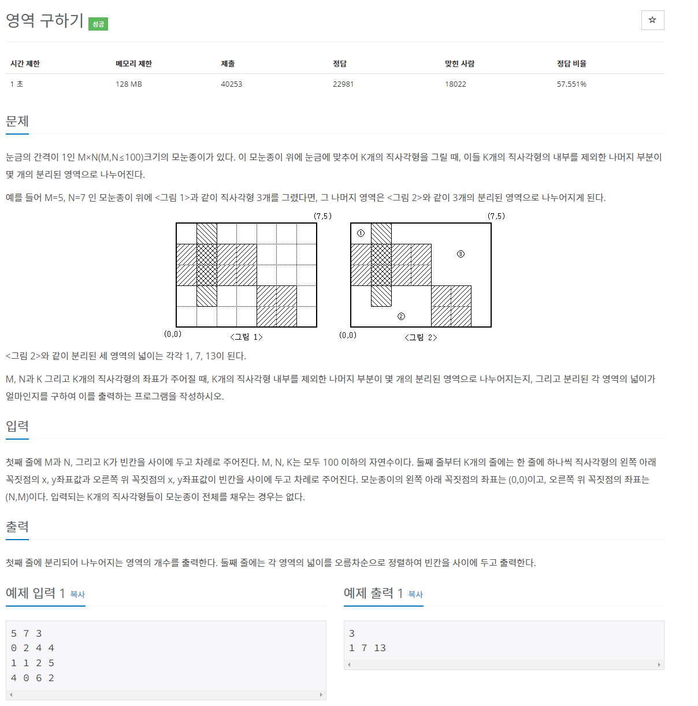
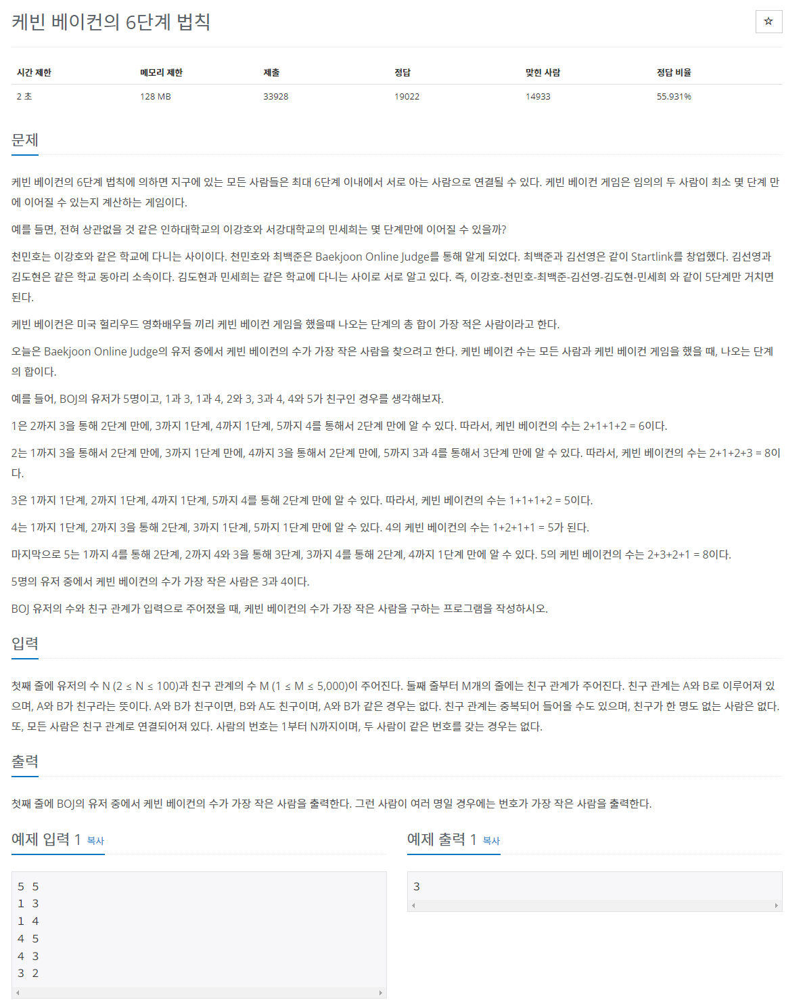
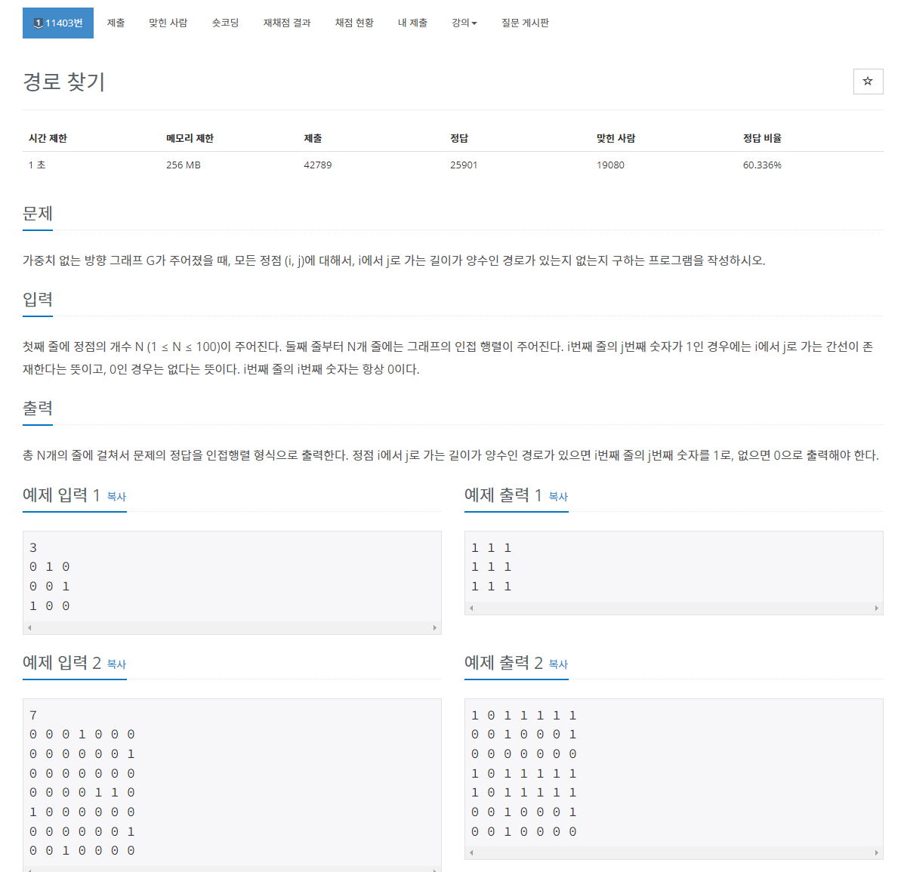
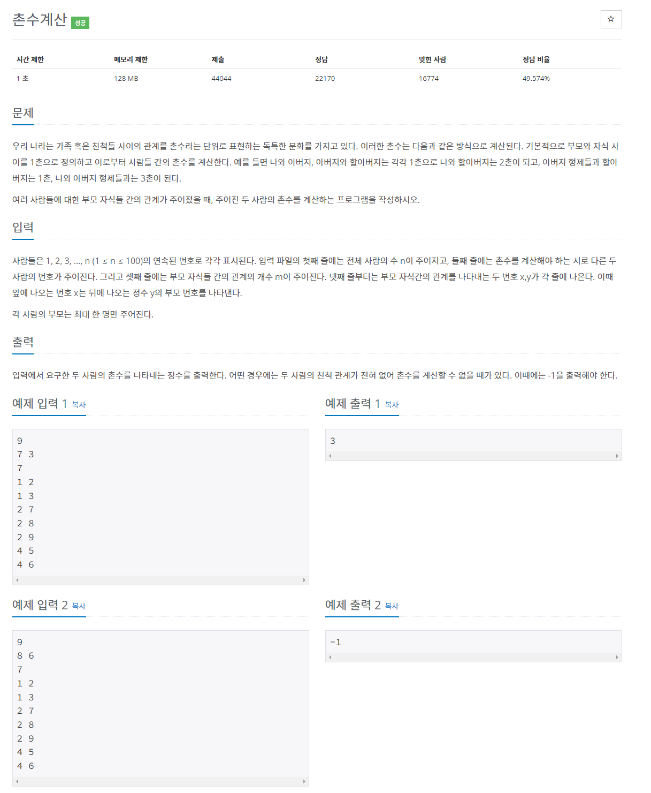
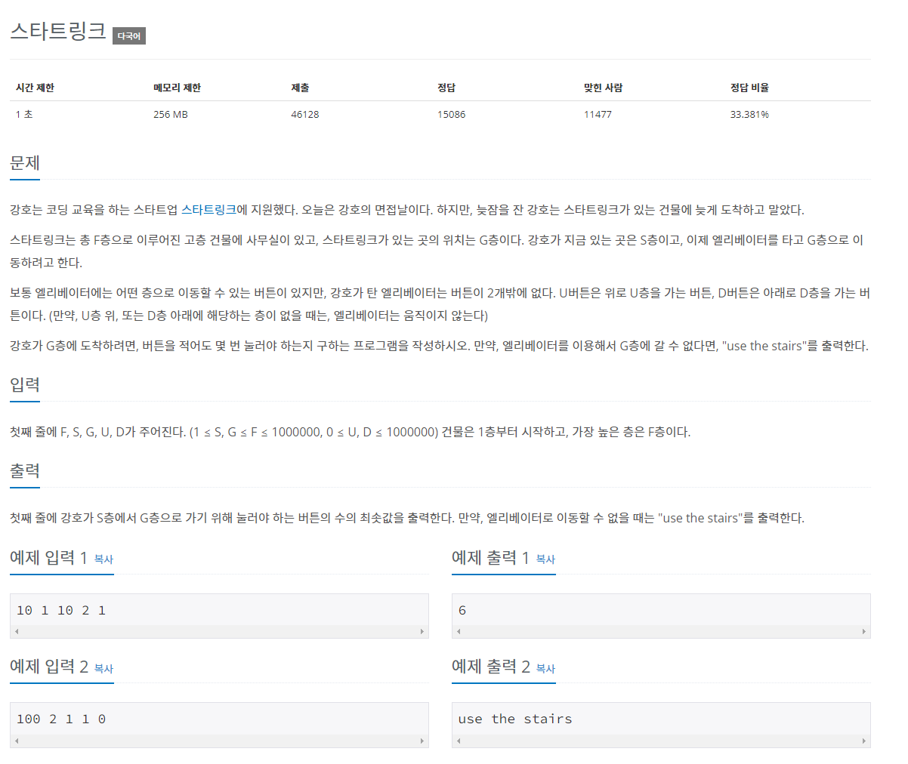
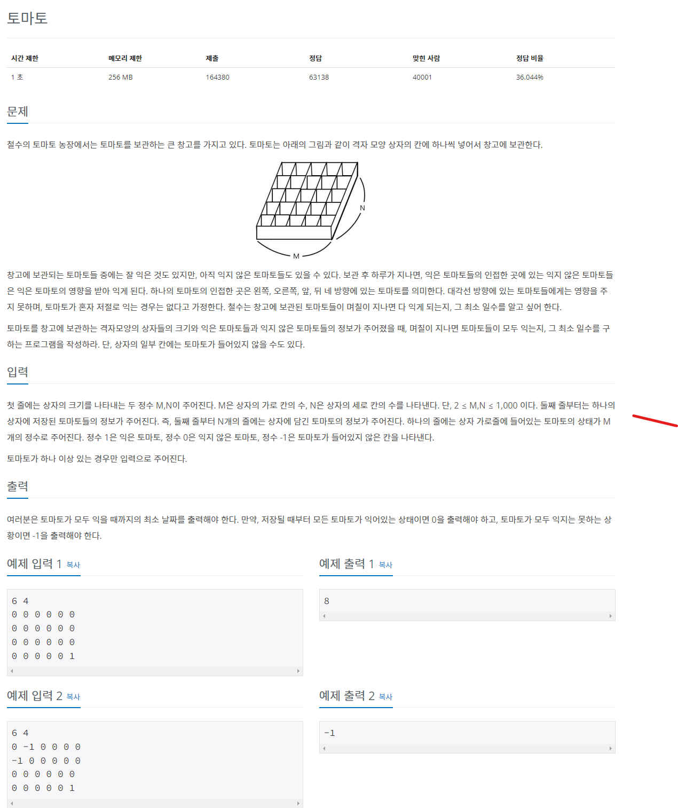
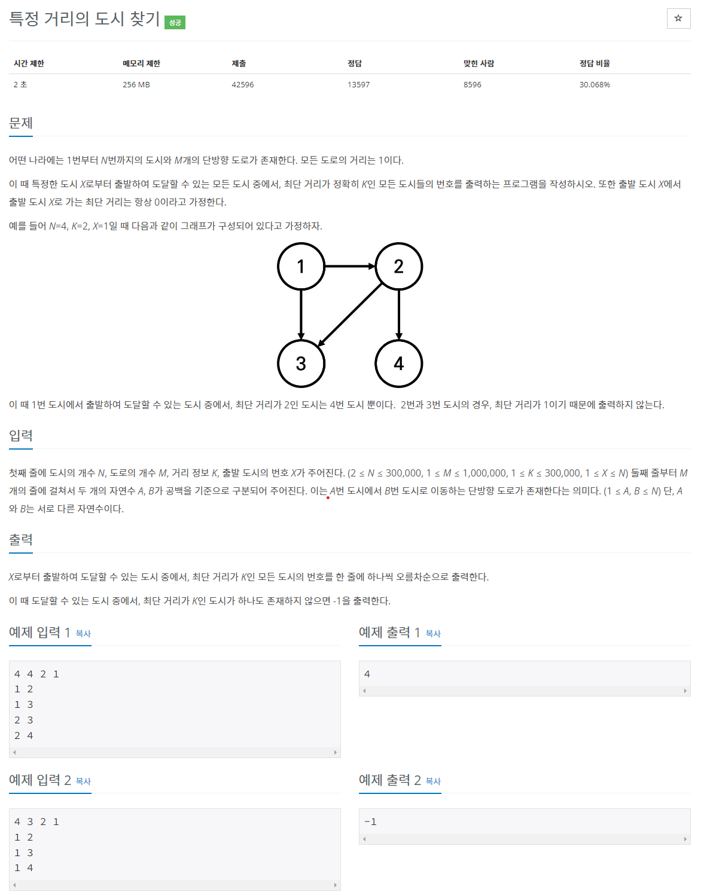

# 2023년 8월 10일 ~ 2023년 8월 13일 TIL

## 백준 2583 영역구하기

### 문제




### 풀이
그래프 문제로 BFS 알고리즘을 이용해 문제를 풀었다. <br>
주어지는 직사각형의 각 X좌표와 Y좌표를 이용해 모눈종이(M, K)위에 그래프를 그리면 된다. <br>

<br>
이때 좌표가 0인 경우 빈 공간으로, <br>
이중 for문으로 그래프의 0인 공간을 찾아야 하고, <br>
이어지는 빈 공간의 경우 하나의 공간으로 인식되므로 BFS 탐색을 하는동안 빈공간을 1로 변경한다.


<br>

```python
import sys
from collections import deque
input = sys.stdin.readline

d = [(0, -1), (1, 0), (0, 1), (-1, 0)]

m, n, k = map(int, input().split())
graph = [[0] * m for _ in range(n)]

for _ in range(k):
  x1, y1, x2, y2 = map(int, input().split())
  for i in range(x1, x2):
    for j in range(y1, y2):
      graph[i][j] = 1

result = []

def bfs(x, y):
  q = deque()
  q.append((x, y))
  graph[x][y] = 1
  count = 1

  while q:
    a, b = q.popleft()

    for dx, dy in d:
      nx = a + dx
      ny = b + dy

      if not (0 <= nx < n) or not ( 0 <= ny < m):
        continue
      if graph[nx][ny] == 0:
        graph[nx][ny] = graph[a][b] + 1
        count += 1
        q.append((nx, ny))

  result.append(count)

total = 0
for i in range(n):
  for j in range(m):
    if graph[i][j] == 0:
      total += 1
      bfs(i, j)

print(total)
result.sort()
for i in result:
  print(i, end=' ')
```

<br>
<br>
<br>

## 백준 1389 케빈 베이컨의 6단계 법칙

### 문제


<br>

### 풀이

많이 들어본 케빈 베이컨 6단계 법칙이 문제로 나와서 신선했던 문제 <br>
우선 서로 친구 관계이기 때문에, 그래프는 양방향으로 추가한다. <br>
예를 들어, 1과 2가 친구라면, 1 -> 2 방향, 2 -> 1 방향 모두 그래프에 추가한다. <br>

<br>

주어진 모든 사람에 대해 케빈 베이컨 수를 알아야 하기 때문에 <br>
for문을 이용해 모든 사용자에 대한 bfs 탐색을 진행한다. <br>

이때, 본문에서 언급된 것처럼, 케빈 베이컨 수는 모든 사용자에 대해 몇 단계만에 알 수 있는지에 대한 합이다. <br>

<br>

모든 사람은 친구 관계로 연결되어 있기 때문에 크게 신경쓸 것 없이 <br> 
BFS 탐색을 했을 때의 최종 탐색 횟수가 제일 적은 유저를 출력하면 된다.


```python
import sys
from collections import deque
input = sys.stdin.readline

N, M = map(int, input().split())

graph = [[] for _ in range(N+1)]

for _ in range(M):
  a, b = map(int, input().split())
  graph[a].append(b)
  graph[b].append(a)


def bfs(v):
  q = deque([v])
  visited[v] = 1

  while q:
    n = q.popleft()

    for i in graph[n]:
      if not visited[i]:
        visited[i] = visited[n] + 1
        q.append(i)

result = []

for i in range(1, N+1):
  visited = [0]*(N+1)
  bfs(i)
  result.append(sum(visited))


print(result.index(min(result)) + 1)
```

<br>
<br>
<br>

## 백준 11403 경로 찾기

### 문제


### 풀이
문제 풀이 자체에 굉장히 애를 먹었던 문제였다. <br>
문제 자체를 이해를 못해서 오래 걸렸는데, 리뷰하는 지금도 오랜만에 보니 처음에 잘 이해가 안갔다. <br>

각 줄은 node를 의미하고, 각 노드의 y좌표는 이동할 수 있는 다른 노드를 의미한다. <br>
문제에서 주어진 그래프를 예를 들면, 1번 노드는 2번 노드로, 2번 노드는 3번 노드로, 3번 노드는 1번 노드로 <br>
이동이 가능하다.

<br>
각 줄마다 방문해야하는 노드로 생각하여 BFS 탐색을 하고, <br>
방문용 그래프를 하나 생성하여, 방문한 곳을 1로 체크한 그래프를 출력한다.


<br>

```python
import sys
from collections import deque
input = sys.stdin.readline

n = int(input())

graph = []
for _ in range(n):
  graph.append(list(map(int, input().split())))

visited = [[0] * n for _ in range(n)]

def bfs(v):
  q = deque([v])
  check = [0 for _ in range(n)]
  
  while q:
    x = q.popleft()

    for i in range(n):
      if check[i] == 0 and graph[x][i] == 1:
        check[i] = 1
        visited[v][i] = 1
        q.append(i)


for i in range(n):
  bfs(i)

print(visited)
```

<br>
<br>
<br>

## 백준 2644 

### 문제


### 풀이
BFS로 풀 수 있다.

```python
import sys
from collections import deque

input = sys.stdin.readline

n = int(input())

a, b = map(int, input().split())

m = int(input())

graph = [[] for _ in range(n + 1)]
for _ in range(m):
    x, y = map(int, input().split())
    graph[x].append(y)
    graph[y].append(x)

visited = [0] * (n + 1)


def bfs(a, b):
    q = deque([a])
    visited[a] = 1

    while q:
        x = q.popleft()
        print(visited)
        if x == b:
            return visited[b] - 1

        for i in graph[x]:
            if visited[i] == 0:
                visited[i] = visited[x] + 1
                q.append(i)

    return -1


print(bfs(a, b))
```

<br>
<br>
<br>

## 백준 5014 스타트링크

### 문제


### 풀이
BFS 알고리즘으로 문제를 풀 수 있다. <br>
UP 혹은 DOWN 으로 이동방향을 정하고, <br>
이동한 층이 유효한 범위(1층 이상 건물 층 수 이하) 내에 있는 경우 큐에 추가한다.

```python
import sys
from collections import deque

input = sys.stdin.readline

# f = 층 수
# s = 지금 있는 층
# g = 목표 층
# u = 위로 u칸
# d = 아래로 d칸
f, s, g, u, d = map(int, input().split())

visited = [0]*(f+1)

def bfs(s):
  q = deque()
  q.append(s)
  
  while q:
    floor = q.popleft()

    if floor == g:
      return visited[floor]

    for _ in range(2):
      ud = floor + u
      dd = floor - d

      if u > 0 and (1 <= ud <= f) and visited[ud] == 0:
        visited[ud] = visited[floor] +1
        q.append(ud)

      if d > 0 and (1 <= dd <= f) and visited[dd] == 0:
        visited[dd] = visited[floor] +1
        q.append(dd)

  return 'use the stairs'


print(bfs(s))
```


## 백준 7576 토마토
### 문제


### 풀이
다른 것보다 토마토가 두 개 동시에 존재할 때에 대한 어려움이 있었던 문제였다. <br>
이 경우 토마토가 존재하는 위치를 큐에 담아 두었다가 BFS 알고리즘을 적용하여야 원하는 답을 얻을 수 있었다.

```python
import sys
from collections import deque

input = sys.stdin.readline

m, n = map(int, input().split())


q = deque()
graph = []
for i in range(n) :
  graph.append(list(map(int, input().split())))

  for j in range(m) :
    if graph[i][j] == 1 :
      q.append((i, j))
      
d = [(-1,0), (1, 0), (0, -1), (0, 1)]

result = 0
def bfs():
  while q:
    x, y = q.popleft()

    for dx, dy in d:
      nx = x + dx
      ny = y + dy

      if (0 <= nx < n) and (0 <= ny < m) and graph[nx][ny] == 0:
        graph[nx][ny] = graph[x][y] + 1
        q.append((nx, ny))


bfs()

for i in range(n):
  for j in range(m):
    if graph[i][j] == 0:
      print(-1)
      break
    else:
      result = max(graph[i][j], result)


print(result - 1)
```

## 백준 18352 특정 거리의 도시 찾기

### 문제


### 풀이
해당 그래프는 양방향 그래프가 아닌 단방향 그래프인 것을 인지하고 문제를 풀어야 한다. <br>
문제를 풀고 오답이 계속 나와서 확인하니, 단방향 그래프가 아닌 양방향 그래프가 주어질 때 문제가 발생했다. <br>

<br>

양방향 그래프인 케이스를 대비하기 위해, <br>
큐에 담긴 번호의 도시는 바로 방문처리를 해줘야 한다.

```python
import sys
from collections import deque

input = sys.stdin.readline

#도시의 개수 N
#도로의 개수 M
#거리 정보 K
#출발 도시 번호 X
n, m, k, x = map(int, input().split())

graph = [[] for _ in range(n+1)]

for _ in range(m):
  a, b = map(int, input().split())
  graph[a].append(b)

def bfs(x, cnt):
  q = deque([x])
  visited[x] = 1

  while q:
    xx = q.popleft()
    if visited[xx] == k+1:
      result.append(xx)
    
    for i in graph[xx]:
      if not visited[i]:
        visited[i] = visited[xx] + 1
        q.append(i)


cnt = 0
visited = [0]*(n+1)
result = []
bfs(x, cnt)

if not result:
  print(-1)
else:
  for i in sorted(result):
    print(i) 
```

