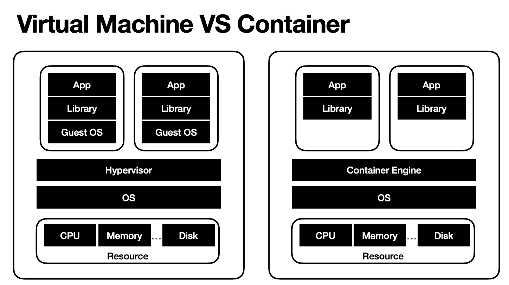
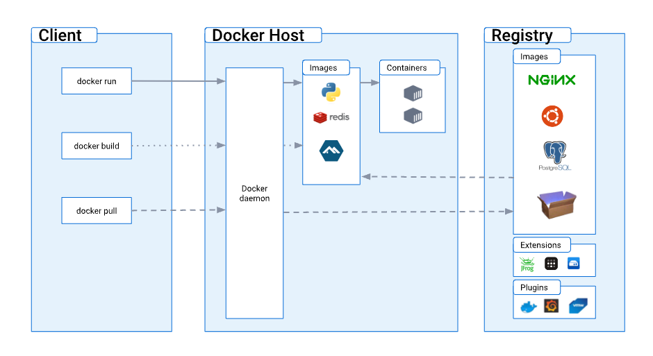
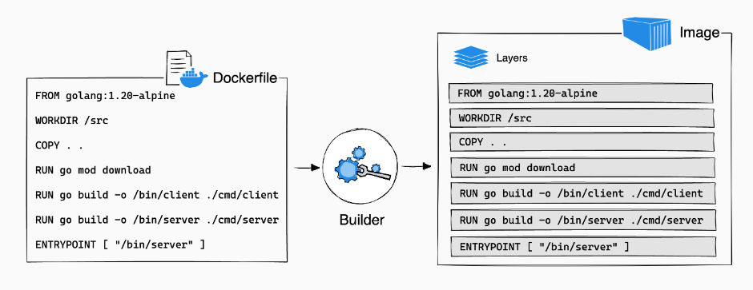
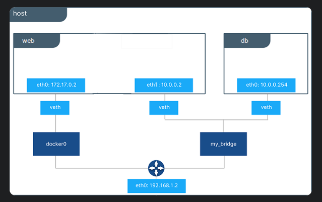
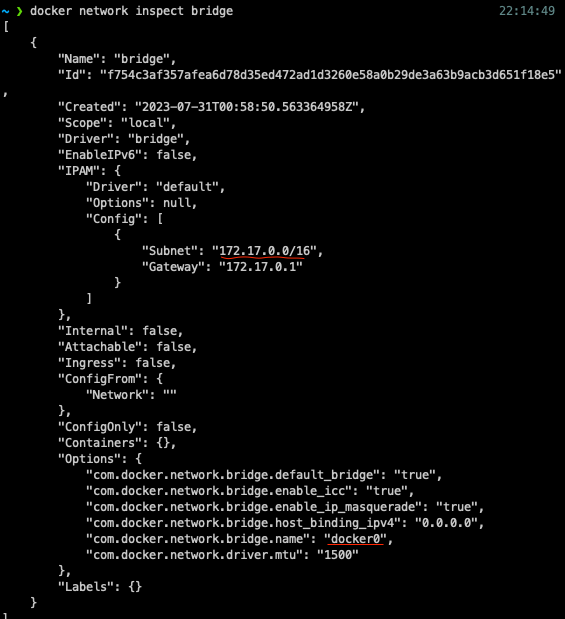

# 2023년 8월 3일 TIL


 ## 🐳 도커란?
```
Docker is an open platform for developing, shipping, and running applications. Docker enables you to separate your applications from your infrastructure so you can deliver software quickly. With Docker, you can manage your infrastructure in the same ways you manage your applications. By taking advantage of Docker’s methodologies for shipping, testing, and deploying code quickly, you can significantly reduce the delay between writing code and running it in production.
```

Docker 공식 문서에 적혀있는 Docker에 대한 설명이다. <br>
나는 Docker 초짜이기 때문에 Docker를 이해하려면 그 바탕이 되는 기술에 대해 이해해야 한다. <br>

<br>

## 👻 가상화
Docker에 대한 이해를 하려면 우선 가상화를 알아야 한다. <br>
다음은 '그림으로 공부하는 IT 인프라 구조' 책에 언급된 가상화에 대한 설명이다.
> 가상화란, 한 마디로 정희하면 '컴퓨터 시스템에서 물리 리소스를 추상화하는 것'이다. 물리 리소스에는 '서버', '네트워크', '저장소' 등이 있지만, 여기선 서버 가상화에 대해 알아보도록 한다. ...(중략)
>

IBM 사이트에 가상화에 대한 좀 더 구체적인 설명을 제공한다. <br>
> 가상화란 물리적 컴퓨터 하드웨어를 보다 효율적으로 활용할 수 있도록 해주는 프로세스이며, 이는 클라우드 컴퓨팅의 기반을 제공합니다. <br>
> 가상화는 소프트웨어를 사용하여 프로세서, 메모리, 스토리지 등과 같은 단일 컴퓨터의 하드웨어 요소를 일반적으로 가상 머신(VM)이라고 하는 다수의 가상 컴퓨터로 분할할 수 있도록 해주는 컴퓨터 하드웨어 상의 추상화 계층을 구축합니다. 실제 기반 컴퓨터 하드웨어의 단지 일부에서만 실행됨에도 불구하고, 각각의 VM은 자체 운영체제(OS)를 실행하며 마치 독립적인 컴퓨터인 것처럼 작동합니다.
>

<br>
여기서 '가상'이라는 키워드를 이해하는데는 다음 설명이 이해에 도움을 줄 수 있습니다. <br>

> Virtual 원래의 의미에서는 '사실과 거의 같다'라는 긍정적인 뜻이 있다. ...(중략) <br>
> 컴퓨터에서 '가상~'이라는 용어가 나오면 '실제가 아닌'이 아니라, 물리적으로 존재하지 않지만 '실제로 존재하는 것과 같다'는 긍정적 의미를 떠올리는 것이 이해가 쉬울 것이다.
> <br>
> [그림으로 공부하는 IT 인프라 구조]

<br>

## 가상 머신
가상 머신(VM) 방식에는 호스트 OS형과 하이퍼바이저형이 있습니다. <br> <br> 
호스트 OS형
- 윈도우즈나 리눅스 등의 호스트 OS상에 가상화 소프트웨어를 설치해서 이용
- VMware server, Microsoft Virtual Server 등이 있다.
- 소프트웨어를 에뮬레이터하는 것으로 성능면에서 제한이 있다.

하이퍼바이저형
- 하드웨어상에서 직접 가상화 소프트웨어를 실행하고 그 위에 가상 머신을 동작시키는 기술
- 호스트 OS를 거치지 않으므로 호스트형보다 성능이 우수하다.


<br>

> 하이퍼바이저란?
> - 가상 머신을 생성하고 구동하는 소프트웨어
> - OS에 자원을 할당하고 조율
> - OS들의 요청을 번역하여 하드웨어에 전달

<br>

## 🫙 컨테이너
위에서 '가상화'에 대해 조금 이해했으니 이제 '컨테이너'가 무엇인지 알아볼 차례이다. <br>
컨테이너를 한 마디로 정의하면 '리소스가 격리된 프로세스'를 의미한다. <br>
컨테이너도 가상화 기술 중 하나로, 하나의 OS상에서 여러 개를 동시에 가동할 수 있으며, 각각 독립된 루트 파일 시스템, CPU/메모리, 프로세스 공간 등을 사용할 수 있다는 점이 하드웨어 가상화인 가상 머신(VM)과의 차이다.
<br>
가상 머신에서는 각 게스트 OS가 커널 공간을 따로 갖지만, 컨테이너는 각 컨테이너가 커널 공간을 공유하는 형태로 동작한다.



<br>


 ## 🐳 도커란?
 자, 이제 첫 번째 질문에 대한 답변을 다시 달 때까 왔다. <br>
 도커는 가상화 기술 중 하나인 컨테이너를 사용한 오픈 플랫폼이다. <br>

<br>

다양한 운영체제에서 사용할 수 있으며, <br> 컨테이너화된 애플리케이션을 손쉽게 빌드, 배포, 관리할 수 있는 다양한 기능을 제공한다.

<br>
그렇다면 이제는 docker가 어떤 기술을 사용해 컨테이너화된 애플리케이션을 손쉽게 빌드, 배포, 관리하는지 알아볼 차례이다.

<br>

## 🖼 도커 아키텍처
도커는 기본적으로 클라이언트-서버 아키텍처를 사용한다. <br>
도커 클라이언트는 도커 컨테이너를 빌드, 실행 및 배포하는 작업을 담당하며, 도커 데몬과 통신한다.
<br>



### 도커 데몬
도커 데몬(dockerd)은 도커 API 요청을 수신하고 이미지, 컨테이너, 네트워크 및 볼륨과 같은 도커 객체를 관리한다. <br>
도커 호스트에서 컨테이너를 생성, 시작, 중지, 삭제하는 등의 작업을 수행하고 컨테이너 이미지를 관리하는 역할을 담당한다.

<br>

### 도커 클라이언트
도커 클라이언트(docker)는 많은 도커 사용자가 도커와 상호 작용하는 기본 방법이다. <br>

`docker run`과 같은 명령어를 사용하면, 클라이언트는 이러한 명령어를 dokerd로 전송한다. 

<br>

### 도커 레지스트리
도커 레지스트리는 도커 이미지를 저장하는 역할을 담당한다. <br>
도커 허브는 누구나 사용할 수 있는 공개 레지스트리이며, Docker는 기본적으로 Docker Hub에 이미지를 찾도로 구성돼 있다.

 <br>


### 도커 개체
도커를 사용하면 이미지, 컨테이너, 네트워크 등 개체를 만들고 사용하게 된다.

#### 도커 이미지
- 이미지는 도커 컨테이너 생성 지침이 포함된 '읽기 전용 템플릿'이다. 
- 사용자는 자신의 이미지를 만들 수도 있고, 다른 사람이 만들고 레지스트리에 게시한 이미지를 사용할 수도 있다.
- 고유한 이미지를 빌드하려면 이미지를 만들고 실행하는 데 필요한 단계를 Dockerfile로 만들면 된다.
- Dockerfile의 각 명령어는 이미지에 레이어를 만든다. 
- Dockerfile을 변경하고 이미지를 다시 빌드하면 변경된 레이어만 다시 빌드된다. 
- 이러한 이미지를 만드는 방식은 다른 가상화 기술에 비해 가볍고 빠르다. 



<br>

### 도커 컨테이너
- 컨테이너는 이미지의 실행 가능한 인스턴스
- Docker API 또는 CLI를 사용해 컨테이너를 생성, 시작, 중지, 이동 또는 삭제할 수 있다.
- 컨테이너를 하나 이상의 네트워크에 연결하거나 스토리지를 연결할 수 있다.
- 컨테이너는 생성하거나 시작할 때 제공하는 구성 옵션과 이미지로 정의된다.

> 예시)
> $  docker run -i -t ubuntu /bin/bash
> 1. 이미지가 로컬에 없는 경우 ubuntu Docker는 마치 수동으로 실행한 것처럼 구성된 레지스트리에서 이미지를 가져온다. `docker pull ubuntu .`
> 2. 도커는 마치 수동으로 명령을 실행한 것처럼 새 컨테이너를 생성한다. `docker container create .`
> 3. 도커는 읽기-쓰기 파일 시스템을 최종 layer로 컨테이너에 할당한다. 이를 통해 실행 중인 컨테이너는 로컬 파일 시스템에서 파일 및 디렉토리를 생성하거나 수정할 수 있다.
> 4. 네트워크 옵션을 지정하지 않아 도커는 컨테이너를 기본 네트워크에 연결하는 네트워크 인터페이스를 생성한다. 여기에는 컨테이너에 IP주소를 할당하는 것이 포함된다. 기본적으로 컨테이너는 호스트 시스템의 네트워크 연결을 사용해 외부 네트워크에 연결할 수 있다.
> 5. Docker는 컨테이너를 시작하고 `/bin/bash`를 실행한다.
> 6. `exit`을 타이밍하면 `/bin/bash` 명령이 종료되고, 컨테이너가 종료된다. 하지만 이때 컨테이너는 삭제되지 않는다.


<br>

자! 이제 거의 도커에 대한 기본적인 개념 정리가 끝나간다. <br>
위에 예시를 읽으면서 갑자기 등장한 키워드가 있는데, 그 키워드가 바로 'network'이다. <br>

도커 네트워크에 대해 간단히 알아보자.

<br>

## 🌏 도커 네트워크

하나의 도커 Host에는 여러 개의 컨테이너가 동작하고 있을 수 있다. <br>
도커 컨테이너는 격리된 환경에서 동작하기 때문에 기본적으로 다른 컨테이너와의 통신이 불가능하다. <br>
하지만 여러 개의 컨테이너를 하나의 Docker 네트워크에 연결시키면 서로 통신이 가능해진다. <br>

### 도커 네트워크 구조

<br>
eth0
- 컨테이너를 생성하면 컨테이너는 호스트와 통신하기 위한 'eth0'이라는 네트워크 인터페이스를 할당받는다. <br>
- 이때, 동시에 호스트에도 veth(virtual ethernet)라는 네트워크 인터페이스가 할당된다. <br>
- veth는 eth0 인터페이스와 통신한다.
- 호스트에서 할당된 veth 인터페이스는 docker0와 바인딩되고, docker0는 호스트의 eth0 인터페이스와 연결되어 외부로부터 들어온 요청을 처리한다.


docker0
- 호스트의 eth0 네트워크 인터페이스와 직접적으로 연결되는 네트워크 인터페이스이다.
- 도커를 설치하면 도커 내부 로직에 의해 자동 할당되는데, 이는 '172.17.x.x'로 시작한다.
- docker0 인터페이스는 호스트의 eth0 인터페이스와 컨테이너의 eth0 인터페이스 사이에서 동작하는 가상의 브릿지이다.
- 컨테이너가 생성되면 컨테이너 내부에 할당되는 eth0 인터페이스와 호스트에 할당되는 veth 인터페이스가 연결되고 docker0에 veth 인터페이스가 바인딩된다.
- 컨테이너가 기본 브릿지 네트워크를 사용하는 경우 외부로 통신할 때는 무조건 docker0 인터페이스를 거쳐야 한다.


veth
- 컨테이너를 실행하게 되면 호스트에 veth 인터페이스가 할당된다.
- veth 인터페이스는 가상의 네트워크 인터페이스로, 자신과 연결된 컨테이너의 네트워크 인터페이스와 패킷을 주고받는 식으로 동작한다.
- 사용자가 직접 생성할 필요없이 도커가 자동으로 생성해주면, veth 인터페이스는 항상 쌍으로 생성된다.
  - 하나는 vethxxxx라는 이름으로 호스트에 생성되며, docker0에 바인딩된다.
  - 하나는 컨테이너 내부에 eth0이라는 이름으로 생성되어 veth 인터페이스와 연결된다.


### 도커 네트워크 종류
이런 도커 네트워크는 도커 네트워크 드라이버(Network Driver)로 종류가 나뉜다.
<br>
Docker를 설치하면 자동으로 생성되는 네트워크 드라이버인 '브리지, 'none(null)', '호스트'에 대해 알아보자.

<br>



#### 브리지
- 브리지는 컨테이너에서 사용하는 기본 네트워크
- Docker가 호스트에 생성한 private한 내부 네트워크
- 모든 컨테이너는 기본적으로 이 네트워크에 연결된다.
- 보통 '172.17.x.x'의 내부 IP가 할당된다.
- 이 내부 IP를 이용해 컨테이너끼리 액세스할 수 있다.
- 외부에서 이 컨테이너에 액세스하려면 컨테이너의 포트를 Docker 호스트의 포트에 매핑한다.
- 브리지 네트워크를 확인하면 docker0 브릿지 네트워크


<br>

#### 호스트
- 도커 호스트와 도커 컨테이너에 네트워크 격리를 발생
- 도커가 제공해주는 가상 네트워크(veth)를 사용하는 것이 아니라 직접 host 네트워크에 붙어서 사용하는 개념
- 그래서 호스트 네트워크를 사용할 경우 포트 바인딩을 하지 않더라도 호스트 네트워크를 사용하기 때문에 접속이 가능
- 예를 들어) 웹 컨테이너에서 포트 5000에 웹 서버를 작동시키려면 웹 컨테이너에서 호스트 네트워클 사용할 경우 포트 매핑 없이 자동으로 같은 포트에 외부 접속이 가능
- 같은 포트의 같은 호스트에서 다수의 웹 컨테이너를 실행할 수 있다.
- 호스트 네트워크에서는 포트가 모든 컨테이너에 공유된다.
  

#### none
- none 네트워크에서 컨테이너는 네트워크 기능을 사용하지 않는다.
- none 네트워크에서 컨테이너는 외부 네트워크나 다른 컨테이너에 액세스 할 수 없다.
- 격리된 네트워크에서 실행

<br>

## User-defined network
자, 이제 마지막으로 'user-defined networks'에 대해 알아보려고 한다. <br>
기본 브리지 네트워크에 연결된 컨테이너는 서로 통신이 가능하다. <br>
<br>

기본적으로 도커는 하나의 내부 브리지 네트워크만 생성한다. <br>
명령어를 사용해 내부 네트워크를 생성하려면 `docker network create`를 입력한 후 드라이버를 bridge로 지정하고, 네트워크 서브넷을 입력한 다음 네트워크 이름을 입력하면 된다.

<br>

> docker network create \
>   --driver bridge \
>   --subnet 182.18.0.0/16
>   custom-network

<br>

그렇다면 사용자 정의 네트워크(user-defined network)가 필요한 이유가 무엇일까? <br>
기본 브리지 네트워크에 사용하는 docker0의 문제점은 DNS를 사용해 자동으로 서비스를 찾아주는 기능이 비활성화 되었다는 것이다. <br>
즉, 이름 식별이 안되기 때문에 IP로만 통신이 가능한다. <br>
컨테이너는 일종의 프로세스이므로, 내렸다 올리는 경우 아이피가 변경되기 때문에, 하나의 컨테이너가 다른 컨테이너를 액세스 할 때 IP를 사용하면 프로세스가 내려갔다 올라갈 때마다 연결 IP를 변경해야 한다. <br>

<br>

반면, 사용자 정의 네트워크의 경우 도커 데몬에 내장된 내부 DNS 서버에 의해 이름으로 통신이 가능하다. <br>
때문에 사용자는 필요한 컨테이너를 하나의 네트워크로 묶어 편하게 통신할 수 있게된다.